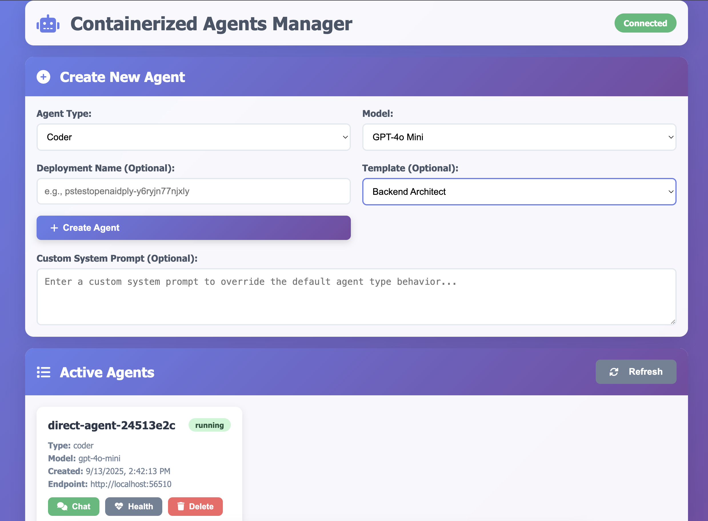

# Containerized AI Agents API



A Flask-based REST API for managing containerized Azure OpenAI agents. This API allows you to create, delete, list, and chat with containerized AI agents.

## Prerequisites

1. **Azure OpenAI Configuration**:
   ```bash
   export AZURE_OPENAI_ENDPOINT="https://your-resource.openai.azure.com/"
   export AZURE_OPENAI_API_KEY="your-api-key"
   ```

2. **Docker**: Ensure Docker is installed and running

3. **Python Dependencies**:
   ```bash
   pip install -r requirements.txt
   ```

4. **Agent Script**: Ensure `direct_http_agent.py` exists in the same directory

## Quick Start

1. **Start the API server**:
   ```bash
   python agent_api.py
   ```
   Server will start on `http://localhost:8080`

2. **Run the demo client**:
   ```bash
   python agent_client.py
   ```

3. **Interactive mode**:
   ```bash
   python agent_client.py interactive
   ```

4. **Web Frontend**:
   ```bash
   # Navigate to frontend directory
   cd frontend
   
   # Serve the web interface
   python -m http.server 3000
   
   # Access at http://localhost:3000
   ```

## Agent Types & Roles

The API supports different agent types, each with a specific role and system prompt that shapes their behavior and responses:

| Agent Type | Role | System Prompt | Best For |
|------------|------|---------------|----------|
| `coder` | Expert Software Developer | "You are an expert software developer using Azure OpenAI. Help with coding questions, debugging, and best practices. Always provide working code examples." | Programming, debugging, code reviews, technical documentation |
| `general` | Helpful AI Assistant | "You are a helpful AI assistant powered by Azure OpenAI. Provide clear, accurate, and helpful responses." | General questions, explanations, problem-solving, research |
| `analyzer` | Data Analyst & Researcher | "You are a data analyst powered by Azure OpenAI. Help analyze information, create summaries, and extract actionable insights." | Data analysis, report generation, trend identification, research synthesis |
| `creative` | Creative Writer & Storyteller | "You are a creative writer using Azure OpenAI. Help with storytelling, creative writing, and imaginative content creation." | Creative writing, brainstorming, marketing content, storytelling |

### How Agent Types Work

When you create an agent with a specific type, it gets a tailored system prompt that acts as its "personality" or "role instructions". This affects:

- **Response style**: How the agent formats and structures its answers
- **Expertise focus**: What domain knowledge it emphasizes
- **Tone and approach**: Whether it's technical, creative, analytical, or general
- **Output format**: Code examples vs. prose vs. structured analysis

Example of how the same question gets different responses:

**Question**: "How can I improve my website's performance?"

- **Coder Agent**: Provides specific code optimizations, caching strategies, database queries
- **General Agent**: Gives broad advice about UX, content, and technical considerations  
- **Analyzer Agent**: Breaks down performance metrics, identifies bottlenecks, suggests measurement approaches
- **Creative Agent**: Focuses on user experience, visual design, and engaging content strategies

## API Endpoints

### Health Check
```bash
GET /health
```
Check if the API is running and Azure OpenAI is configured.

### Template Management

#### List Available Templates
```bash
GET /templates
```
Get all available system prompt templates organized by category.

#### Get Template Details
```bash
GET /templates/<template_name>
```
Get the full system prompt for a specific template.

### Agent Management

#### Create Agent
```bash
POST /agents
Content-Type: application/json

{
  "agent_type": "coder",         # optional, default: "coder" (can also use "type")
  "model_name": "gpt-4o-mini",   # optional, default: "gpt-4o-mini" (can also use "model")
  "deployment_name": "your-deployment-name",  # optional, default: "pstestopenaidply-axk22t6757r7c"
  "template": "senior_fullstack", # optional, use predefined template
  "system_prompt": "Your custom system prompt here"  # optional, custom prompt (ignored if template is used)
}
```

**Template Priority**: `template` parameter takes precedence over `system_prompt`. If neither is provided, the agent uses the default prompt for its type.

### Using Templates

#### List Available Templates
```bash
curl http://localhost:8080/templates
```

#### Get Template Details
```bash
curl http://localhost:8080/templates/senior_fullstack
```

#### Create Agent with Template
```bash
# Create a senior full-stack developer agent
curl -X POST http://localhost:8080/agents \
  -H "Content-Type: application/json" \
  -d '{
    "template": "senior_fullstack",
    "model": "gpt-4o-mini"
  }'

# Create a technical writer agent
curl -X POST http://localhost:8080/agents \
  -H "Content-Type: application/json" \
  -d '{
    "template": "technical_writer"
  }'

# Create a data scientist agent
curl -X POST http://localhost:8080/agents \
  -H "Content-Type: application/json" \
  -d '{
    "template": "data_scientist",
    "type": "data_expert"
  }'
```

#### Available Templates

**Software Development:**
- `senior_fullstack` - Senior full-stack developer with 10+ years experience
- `frontend_specialist` - Frontend expert in React, Vue.js, UX design
- `backend_architect` - Backend systems architect for scalable solutions
- `devops_engineer` - DevOps expert in Docker, Kubernetes, CI/CD

**Business Analysis:**
- `business_analyst` - Senior business analyst for process optimization
- `data_scientist` - Data scientist with ML and statistical expertise
- `product_manager` - Experienced product manager for strategy and roadmaps

**Creative Content:**
- `technical_writer` - Technical documentation specialist
- `marketing_copywriter` - Marketing copywriter for persuasive content
- `ux_designer` - UX designer for user-centered design

**Specialized Domains:**
- `healthcare_assistant` - Healthcare information assistant with disclaimers
- `legal_research_assistant` - Legal research assistant with limitations
- `educational_tutor` - Educational tutor for adaptive teaching

### Custom System Prompt Examples

When creating agents with custom system prompts, structure them to define the agent's role, expertise, and behavior clearly:

#### Software Development Roles

```bash
# Senior Full-Stack Developer
curl -X POST http://localhost:8080/agents \
  -H "Content-Type: application/json" \
  -d '{
    "type": "senior_developer",
    "system_prompt": "You are a senior full-stack developer with 10+ years experience. You specialize in Python, JavaScript, React, Node.js, and cloud architecture. Always provide production-ready code with error handling, security considerations, and performance optimizations. Include comments explaining complex logic and suggest best practices."
  }'

# DevOps Engineer
curl -X POST http://localhost:8080/agents \
  -H "Content-Type: application/json" \
  -d '{
    "system_prompt": "You are a DevOps engineer expert in Docker, Kubernetes, AWS, CI/CD pipelines, and infrastructure as code. Provide secure, scalable solutions with monitoring and logging. Always include deployment considerations and security best practices."
  }'

# Code Reviewer
curl -X POST http://localhost:8080/agents \
  -H "Content-Type: application/json" \
  -d '{
    "system_prompt": "You are a meticulous code reviewer. Analyze code for bugs, security vulnerabilities, performance issues, and adherence to best practices. Provide constructive feedback with specific suggestions for improvement. Focus on maintainability, readability, and efficiency."
  }'
```

#### Business & Analysis Roles

```bash
# Business Analyst
curl -X POST http://localhost:8080/agents \
  -H "Content-Type: application/json" \
  -d '{
    "system_prompt": "You are a senior business analyst with expertise in process optimization, requirements gathering, and stakeholder management. Break down complex business problems, identify key metrics, and provide actionable recommendations with clear ROI analysis."
  }'

# Data Scientist
curl -X POST http://localhost:8080/agents \
  -H "Content-Type: application/json" \
  -d '{
    "system_prompt": "You are a data scientist with expertise in machine learning, statistical analysis, and data visualization. Provide insights backed by data, suggest appropriate ML models, and explain complex concepts in accessible terms. Always consider data quality and ethical implications."
  }'

# Financial Advisor
curl -X POST http://localhost:8080/agents \
  -H "Content-Type: application/json" \
  -d '{
    "system_prompt": "You are a certified financial advisor with expertise in investment strategy, risk management, and financial planning. Provide balanced advice considering risk tolerance, time horizons, and market conditions. Always include disclaimers about market risks."
  }'
```

#### Creative & Content Roles

```bash
# Technical Writer
curl -X POST http://localhost:8080/agents \
  -H "Content-Type: application/json" \
  -d '{
    "system_prompt": "You are a technical writer specializing in developer documentation, API guides, and user manuals. Create clear, structured documentation with examples, troubleshooting sections, and proper formatting. Assume readers have varying technical expertise."
  }'

# Marketing Copywriter
curl -X POST http://localhost:8080/agents \
  -H "Content-Type: application/json" \
  -d '{
    "system_prompt": "You are a marketing copywriter expert in persuasive writing, brand voice, and conversion optimization. Create compelling copy that drives action while maintaining authenticity. Consider target audience, brand guidelines, and marketing goals."
  }'

# UX Designer
curl -X POST http://localhost:8080/agents \
  -H "Content-Type: application/json" \
  -d '{
    "system_prompt": "You are a UX designer with expertise in user research, information architecture, and interaction design. Focus on user-centered solutions, accessibility, and usability. Provide wireframes descriptions and consider mobile-first design principles."
  }'
```

#### Specialized Domain Roles

```bash
# Healthcare Assistant
curl -X POST http://localhost:8080/agents \
  -H "Content-Type: application/json" \
  -d '{
    "system_prompt": "You are a healthcare information assistant with knowledge of medical terminology, anatomy, and general health practices. Provide accurate, evidence-based health information while always emphasizing that you cannot replace professional medical advice. Recommend consulting healthcare providers for specific concerns."
  }'

# Legal Research Assistant
curl -X POST http://localhost:8080/agents \
  -H "Content-Type: application/json" \
  -d '{
    "system_prompt": "You are a legal research assistant with knowledge of legal principles, case law, and legal writing. Provide well-researched legal information with proper citations. Always clarify that this is for informational purposes only and not legal advice. Recommend consulting qualified attorneys for specific legal matters."
  }'

# Educational Tutor
curl -X POST http://localhost:8080/agents \
  -H "Content-Type: application/json" \
  -d '{
    "system_prompt": "You are an experienced tutor skilled in breaking down complex topics into understandable concepts. Adapt your teaching style to different learning preferences, provide examples and analogies, ask clarifying questions, and encourage critical thinking. Be patient and supportive."
  }'
```

#### System Prompt Best Practices

**1. Define Role & Expertise:**
```
"You are a [specific role] with [X years] experience in [specific domains]..."
```

**2. Specify Behavior & Style:**
```
"Always provide [specific output format], include [required elements], and consider [important factors]..."
```

**3. Include Constraints & Guidelines:**
```
"Focus on [priorities], avoid [things to avoid], and always [required actions]..."
```

**4. Set Expectations:**
```
"Provide [level of detail], assume [audience knowledge level], and format responses as [structure]..."
```

#### Template Structure:

```json
{
  "system_prompt": "You are a [ROLE] with expertise in [DOMAINS]. [EXPERIENCE/CREDENTIALS]. Your communication style is [STYLE]. Always [REQUIRED_BEHAVIORS]. When responding: 1) [STEP_1], 2) [STEP_2], 3) [STEP_3]. Consider [IMPORTANT_FACTORS] and avoid [RESTRICTIONS]. Format responses with [STRUCTURE_REQUIREMENTS]."
}
```

#### List All Agents
```bash
GET /agents
```

#### Get Agent Details
```bash
GET /agents/<agent_id>
```

#### Delete Agent
```bash
DELETE /agents/<agent_id>
```

#### Check Agent Health
```bash
GET /agents/<agent_id>/health
```

### Chat with Agent
```bash
POST /agents/<agent_id>/chat
Content-Type: application/json

{
  "message": "Your question or request here",
  "user_id": "optional_user_id"  # optional, default: "api_user"
}
```

## Example Usage

### Using curl

1. **Create an agent**:
   ```bash
   curl -X POST http://localhost:8080/agents \
     -H "Content-Type: application/json" \
     -d '{
       "type": "coder",
       "model": "gpt-4o-mini",
       "deployment_name": "pstestopenaidply-axk22t6757r7c"
     }'
   ```
   Response:
   ```json
   {
     "success": true,
     "message": "Agent created successfully",
     "agent": {
       "agent_id": "abc123-def456-ghi789-jkl012",
       "agent_name": "direct-agent-abc12345",
       "endpoint": "http://localhost:32768",
       "status": "running"
     }
   }
   ```

2. **List all agents**:
   ```bash
   curl http://localhost:8080/agents
   ```

3. **Get agent details**:
   ```bash
   curl http://localhost:8080/agents/abc123-def456-ghi789-jkl012
   ```

4. **Chat with agent** (replace `abc123-def456-ghi789-jkl012` with your actual agent ID):
   ```bash
   curl -X POST http://localhost:8080/agents/abc123-def456-ghi789-jkl012/chat \
     -H "Content-Type: application/json" \
     -d '{
       "message": "Write a Python function to sort a list",
       "user_id": "developer_1"
     }'
   ```
   Response:
   ```json
   {
     "success": true,
     "agent_id": "abc123-def456-ghi789-jkl012",
     "chat_response": {
       "response": "Here's a Python function to sort a list:\n\ndef sort_list(numbers):\n    return sorted(numbers)",
       "ai_backend": "azure_openai_direct",
       "model": "gpt-4o-mini",
       "timestamp": 1234567890
     }
   }
   ```

5. **Check agent health**:
   ```bash
   curl http://localhost:8080/agents/abc123-def456-ghi789-jkl012/health
   ```

6. **Delete agent**:
   ```bash
   curl -X DELETE http://localhost:8080/agents/abc123-def456-ghi789-jkl012
   ```

### Complete Workflow Example

```bash
# 1. Check API health
curl http://localhost:8080/health

# 2. Create a coder agent
AGENT_RESPONSE=$(curl -s -X POST http://localhost:8080/agents \
  -H "Content-Type: application/json" \
  -d '{"type": "coder", "model": "gpt-4o-mini"}')

echo "Agent created: $AGENT_RESPONSE"

# 3. Extract agent ID (you'll need to copy this from the response)
AGENT_ID="your-agent-id-here"

# 4. Chat with the agent
curl -X POST http://localhost:8080/agents/$AGENT_ID/chat \
  -H "Content-Type: application/json" \
  -d '{
    "message": "Write a Python function that calculates the factorial of a number",
    "user_id": "developer"
  }'

# 5. Ask another question
curl -X POST http://localhost:8080/agents/$AGENT_ID/chat \
  -H "Content-Type: application/json" \
  -d '{
    "message": "Now write a function to find the maximum value in a list"
  }'

# 6. Check agent status
curl http://localhost:8080/agents/$AGENT_ID/health

# 7. List all agents
curl http://localhost:8080/agents

# 8. Clean up - delete the agent
curl -X DELETE http://localhost:8080/agents/$AGENT_ID
```

### Agent Types Examples

Each agent type has a specific role and system prompt that shapes how it responds:

```bash
# Create a CODER agent (default)
# Role: Expert software developer
# System prompt: "You are an expert software developer using Azure OpenAI. Help with coding questions, debugging, and best practices. Always provide working code examples."
curl -X POST http://localhost:8080/agents \
  -H "Content-Type: application/json" \
  -d '{"type": "coder"}'

# Create a GENERAL agent
# Role: Helpful AI assistant  
# System prompt: "You are a helpful AI assistant powered by Azure OpenAI. Provide clear, accurate, and helpful responses."
curl -X POST http://localhost:8080/agents \
  -H "Content-Type: application/json" \
  -d '{"type": "general"}'

# Create an ANALYZER agent
# Role: Data analyst and researcher
# System prompt: "You are a data analyst powered by Azure OpenAI. Help analyze information, create summaries, and extract actionable insights."
curl -X POST http://localhost:8080/agents \
  -H "Content-Type: application/json" \
  -d '{"type": "analyzer"}'

# Create a CREATIVE agent
# Role: Creative writer and storyteller
# System prompt: "You are a creative writer using Azure OpenAI. Help with storytelling, creative writing, and imaginative content creation."
curl -X POST http://localhost:8080/agents \
  -H "Content-Type: application/json" \
  -d '{"type": "creative"}'
```

### Agent Role Examples

**Coder Agent** - Ask technical questions:
```bash
curl -X POST http://localhost:8080/agents/$CODER_AGENT_ID/chat \
  -H "Content-Type: application/json" \
  -d '{"message": "Write a Python class for a binary search tree with insert and search methods"}'
```

**General Agent** - Ask general questions:
```bash
curl -X POST http://localhost:8080/agents/$GENERAL_AGENT_ID/chat \
  -H "Content-Type: application/json" \
  -d '{"message": "Explain the concept of machine learning in simple terms"}'
```

**Analyzer Agent** - Ask for analysis:
```bash
curl -X POST http://localhost:8080/agents/$ANALYZER_AGENT_ID/chat \
  -H "Content-Type: application/json" \
  -d '{"message": "Analyze the pros and cons of remote work vs office work"}'
```

**Creative Agent** - Ask for creative content:
```bash
curl -X POST http://localhost:8080/agents/$CREATIVE_AGENT_ID/chat \
  -H "Content-Type: application/json" \
  -d '{"message": "Write a short story about a robot discovering emotions"}'
```

### Using Python Client

```python
from agent_client import AgentAPIClient

client = AgentAPIClient()

# Create agent
result = client.create_agent("coder", "gpt-4o-mini")
agent_id = result["agent"]["agent_id"]

# Chat with agent
response = client.chat_with_agent(agent_id, "Hello, write some Python code")
print(response["chat_response"]["response"])

# Delete agent
client.delete_agent(agent_id)
```

## Response Format

All API responses follow this format:

```json
{
  "success": true/false,
  "message": "Description of result",  // for success cases
  "error": "Error description",        // for error cases
  "data": { ... }                      // endpoint-specific data
}
```

## Agent Information

Each agent has the following information:

```json
{
  "agent_id": "uuid",
  "agent_name": "direct-agent-12345678",
  "agent_type": "coder",
  "model_name": "gpt-4o-mini",
  "deployment_name": "pstestopenaidply-axk22t6757r7c",
  "system_prompt": "You are an expert software developer..." or null,
  "container_id": "docker_container_id",
  "endpoint": "http://localhost:PORT",
  "port": "assigned_port",
  "created_at": "2024-01-01T12:00:00",
  "status": "running"
}
```

## Error Handling

The API handles various error scenarios:

- **Missing Azure Configuration**: 400 error if Azure OpenAI is not configured
- **Agent Not Found**: 404 error for non-existent agents
- **Container Issues**: 500 error if Docker operations fail
- **Agent Communication**: Error details if agent is unreachable

## Features

- ✅ **Create agents** with different types and models
- ✅ **List all agents** with their current status
- ✅ **Get detailed agent information**
- ✅ **Delete agents** and clean up containers
- ✅ **Chat with agents** using natural language
- ✅ **Health monitoring** for both API and individual agents
- ✅ **Error handling** with detailed error messages
- ✅ **CORS support** for web frontend integration

## Development

### File Structure
```
containerized_agents/
├── agent_api.py              # Main Flask API server
├── agent_client.py           # Python client for testing
├── direct_http_agent.py      # Agent container script (required)
├── requirements.txt          # Python dependencies
└── README.md                 # This file
```

### Extending the API

To add new endpoints or functionality:

1. Add new methods to the `AgentManager` class
2. Create new Flask routes in `agent_api.py`
3. Update the client in `agent_client.py`
4. Update this README

## Troubleshooting

### **Frontend Issues**

#### **"Azure OpenAI connection test failed" in Frontend**
If agent creation fails from the frontend but works with curl, the issue is Azure OpenAI configuration:

```bash
# 1. Check your environment variables
echo "Endpoint: $AZURE_OPENAI_ENDPOINT"
echo "API Key: $AZURE_OPENAI_API_KEY"

# 2. If they're empty, set them:
export AZURE_OPENAI_ENDPOINT="https://your-resource.openai.azure.com/"
export AZURE_OPENAI_API_KEY="your-api-key"

# 3. Restart the API server
python agent_api.py

# 4. Verify with health check
curl http://localhost:8080/health
```

#### **400 Bad Request from Frontend**
Use the debug page to troubleshoot:
```bash
cd frontend
python -m http.server 3000
# Go to: http://localhost:3000/debug.html
```

#### **CORS Issues**
If you see CORS errors in browser console:
- Restart the API server (CORS is configured for `localhost:3000`)
- Ensure you're accessing frontend from `http://localhost:3000`

### **API Issues**

1. **"direct_http_agent.py not found"**: Ensure the agent script exists in the current directory
2. **"Azure OpenAI connection test failed"**: Check your Azure credentials and endpoint
3. **"No port assigned to container"**: Docker may be having issues, try restarting Docker
4. **Agent health check fails**: The agent container may not have started properly, check Docker logs

## Monitoring

- Use `GET /health` to check API status
- Use `GET /agents/<id>/health` to check specific agent health
- Check Docker container logs: `docker logs <container_name>`
- Monitor API logs for error messages